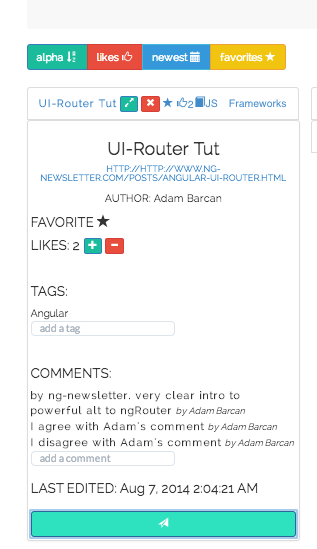

#note_ify#

note_ify is a social read-it-later built as a single-page app on the full MEAN Javascript stack. note_ify allows members of a community to save, rate and find relevant web content in shared notebooks. Users like, favorite, tag and comment on others' content. There is full-text search functionality. I built app in a week as my capstone individual project at [Fullstack Academy](http://fullstackacademy.com)

##HOW TO USE##
note_ify is deployed on [Heroku](https://note-ify.herokuapp.com).  

##CONTRIBUTOR##
- [Adam Barcan](https://github.com/Adam262)

##SCREENSHOTS##
*Starting Page*

*Mobile Responsive*

*Create or view notebooks containing notes*

*Search and sort in real time*

*Expand note to like, rate, tag and/or comment*

*View curated content from profile*

##TECHNOLOGIES USED##
+ Angular.js 
+ ngAnimate directive
+ Node.js
+ MongoDB
+ Twitter Bootstrap

##CHALLENGES##
+ routing for content update. I had issues updating note tag and comment fields via PUT requests. My current solution works but is expensive in that it updates complete note object rather than simply updating edited fields.
+ I had a hard time getting the tile sorting library Isotope.js to work in Angular. I finally switched to ngAnimate directive given my short deadline.
+ deploying to Heroku.   note_ify was my first deployment - I encountered a lot of dependencyconflicts in both Node and Angular. But learned a lot that will make my next deployment smoother!

##IMPROVEMENTS##
+ add drag and drop functionality.
+ lock content delete to author only - this is quick. 
+ expand existing Facebook integration to allow sharing of notes and notebooks among Facebook friends.
+ integrate to other social media APIs to allow file sharing.

##ISSUES?##
Any issues using note_ify? Please create a new issue in issues section of this repo.  
